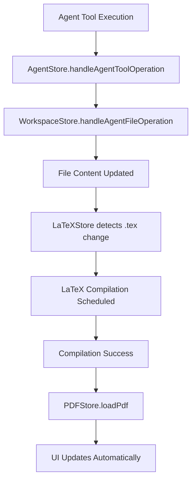
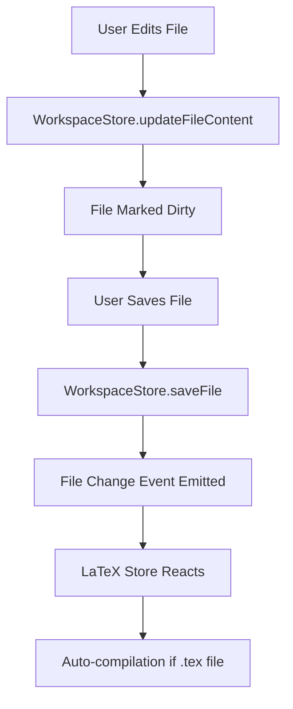
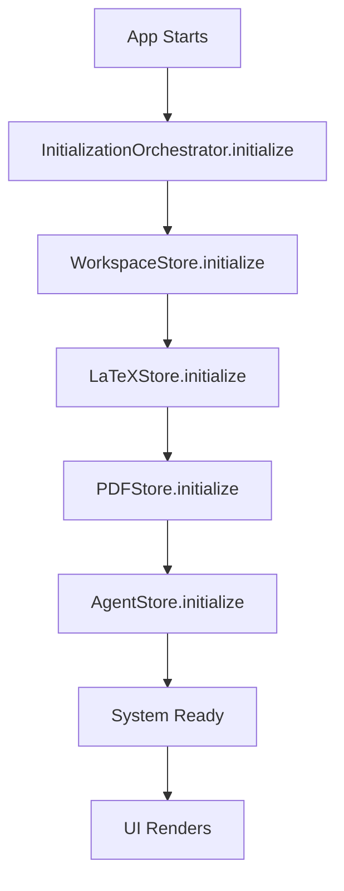

# DCMT Editor - Reactive Store Architecture

## Overview

DCMT Editor uses a **reactive store architecture** that provides predictable, scalable state management. This document outlines the current system design, data flow, and integration patterns.

## 🏗️ Architecture Principles

### 1. **Single Source of Truth**
Each domain (files, LaTeX, PDF, agent) has one centralized store that manages all related state.

### 2. **Reactive Data Flow**
Changes flow automatically through the system:
```
File Change → WorkspaceStore → LaTeXStore → PDFStore → UI Updates
```

### 3. **Predictable Initialization**
All stores initialize in a specific order with dependency management via the InitializationOrchestrator.

### 4. **Clean Integration**
Agent operations integrate seamlessly by updating stores, which trigger the entire reactive chain.

## 🗂️ Store Structure

### Core Stores

#### **WorkspaceStore** (`src/lib/stores/workspace.ts`)
- **Purpose**: Centralized file and workspace management
- **Responsibilities**:
  - File content storage and caching
  - Open files and active file tracking
  - LaTeX file detection and main file identification
  - Agent file operation integration
- **Key State**:
  ```typescript
  interface WorkspaceState {
    isReady: boolean;
    files: Map<string, FileContent>;
    openFiles: string[];
    activeFile: string | null;
    mainLatexFile: string | null;
    latexFiles: string[];
  }
  ```
- **Key Methods**:
  - `loadFile(path)` - Load and cache file content
  - `saveFile(path)` - Save file with dirty state tracking
  - `handleAgentFileOperation(tool, path, content)` - Process agent changes

#### **LaTeXStore** (`src/lib/stores/latex.ts`)
- **Purpose**: LaTeX compilation lifecycle management
- **Responsibilities**:
  - Auto-compilation when .tex files change
  - Compilation queuing and debouncing
  - Result tracking with history
  - Integration with workspace file changes
- **Key State**:
  ```typescript
  interface LaTeXState {
    mainFile: string | null;
    compilationStatus: 'idle' | 'queued' | 'compiling' | 'success' | 'error';
    currentPdfPath: string | null;
    lastCompilation: LaTeXCompilationResult | null;
    autoCompile: boolean;
  }
  ```
- **Key Methods**:
  - `scheduleCompilation(reason)` - Queue compilation with debouncing
  - `compileCurrentFile()` - Execute compilation
  - `handleAgentFileOperation(tool, path)` - React to agent changes

#### **PDFStore** (`src/lib/stores/pdf.ts`)
- **Purpose**: PDF preview and viewer management
- **Responsibilities**:
  - PDF.js integration and loading
  - Viewer controls (zoom, pages, rotation)
  - Auto-refresh when LaTeX compilation succeeds
  - Canvas rendering management
- **Key State**:
  ```typescript
  interface PDFState {
    currentPdf: PDFDocument | null;
    isLoading: boolean;
    viewer: PDFViewerState;
    canvas: HTMLCanvasElement | null;
    autoRefresh: boolean;
  }
  ```
- **Key Methods**:
  - `loadPdf(path)` - Load PDF document
  - `setCanvas(canvas)` - Connect canvas for rendering
  - `renderCurrentPage()` - Render current page to canvas
  - Viewer controls: `nextPage()`, `prevPage()`, `zoomIn()`, `zoomOut()`, `rotate()`

#### **AgentStore** (`src/lib/stores/agent.ts`)  
- **Purpose**: Agent system integration
- **Responsibilities**:
  - Agent session management
  - Message handling and streaming
  - Clean integration with other stores
  - File operation coordination
- **Key Integration Methods**:
  - `handleAgentToolOperation(tool, path, result)` - Coordinate with other stores
  - `handleEnhancedFileOperation(operation)` - Process file operations

#### **InitializationOrchestrator** (`src/lib/stores/orchestrator.ts`)
- **Purpose**: Predictable system startup
- **Responsibilities**:
  - Manage initialization order and dependencies
  - Error handling and retry logic
  - Progress tracking
  - System cleanup on shutdown

## 🔄 Data Flow Patterns

### 1. **Agent File Operations**


### 2. **Manual File Changes**


### 3. **System Initialization**


## 🛠️ Integration Patterns

### Using Stores in Components

#### **Reactive State Access**
```svelte
<script lang="ts">
  import { workspaceStore, latexStore, pdfStore } from '$lib/stores';
  
  // Reactive state
  const workspaceState = $derived($workspaceStore);
  const latexState = $derived($latexStore);  
  const pdfState = $derived($pdfStore);
  
  // Derived store access
  const hasValidPdf = $derived($pdfStore.hasValidPdf);
  const canCompile = $derived(latexStore.canCompile());
</script>
```

#### **Store Method Calls**
```svelte
<script lang="ts">
  import { workspaceStore, latexStore, pdfStore } from '$lib/stores';
  
  async function handleFileOpen(path: string) {
    await workspaceStore.openFile(path);
  }
  
  function handleCompile() {
    latexStore.forceCompile();
  }
  
  function handleZoomIn() {
    pdfStore.zoomIn();
  }
</script>
```

#### **System Initialization**
```svelte
<script lang="ts">
  import { onMount } from 'svelte';
  import { orchestrator } from '$lib/stores';
  import { useQueryClient } from '@tanstack/svelte-query';
  
  onMount(async () => {
    const queryClient = useQueryClient();
    
    await orchestrator.initialize({
      rootPath: '',
      queryClient,
      skipAgentInit: false
    });
  });
</script>
```

### Store Extension Patterns

#### **Adding New File Types**
1. Extend `WorkspaceStore` to detect new file types
2. Create new store for the file type (e.g., `MarkdownStore`)
3. Add integration methods to `AgentStore`
4. Update `InitializationOrchestrator` if needed

#### **Adding New Compilation Targets**
1. Extend `LaTeXStore` or create parallel compilation store
2. Add platform API methods for new compiler
3. Integrate with existing reactive flow

## 🧪 Testing Patterns

### Store Testing
```typescript
// Test stores in isolation
import { get } from 'svelte/store';
import { workspaceStore } from '$lib/stores/workspace';

// Test state changes
await workspaceStore.loadFile('test.tex');
const state = get(workspaceStore);
expect(state.files.has('test.tex')).toBe(true);
```

### Integration Testing  
```typescript
// Test reactive chains
await workspaceStore.handleAgentFileOperation('update_file', 'main.tex', 'content');
// Verify LaTeX store reacts
const latexState = get(latexStore);
expect(latexState.compilationStatus).toBe('queued');
```

## 🚨 Common Issues & Solutions

### **Issue**: Stores not initializing properly
**Solution**: Use `InitializationOrchestrator` and check initialization order

### **Issue**: Agent changes not triggering UI updates  
**Solution**: Verify `AgentStore.handleAgentToolOperation()` is called and store integration is working

### **Issue**: PDF not refreshing after compilation
**Solution**: Check LaTeX→PDF store integration and auto-refresh settings

### **Issue**: Race conditions on page refresh
**Solution**: Use `orchestrator.initialize()` and wait for `isReady` state

## 📁 File Structure

```
src/lib/stores/
├── index.ts              # Unified exports
├── workspace.ts          # File & workspace management  
├── latex.ts              # LaTeX compilation
├── pdf.ts                # PDF preview & viewer
├── agent.ts              # Agent system integration
├── orchestrator.ts       # Initialization management
└── legacy/               # Old stores (being migrated)
    ├── files.ts
    ├── editor.ts
    └── chat.ts
```

## 🔄 Migration Status

### ✅ **Completed**
- WorkspaceStore (centralized file management)
- LaTeXStore (reactive compilation)  
- PDFStore (reactive preview)
- AgentStore (clean integration)
- InitializationOrchestrator (predictable startup)
- PDFPreview component (fully reactive)

### 🚧 **In Progress**
- Editor components migration to new stores
- Complete removal of old event system

### 📋 **Planned**
- Migration of remaining components
- Performance optimizations
- Additional file type support

## 🎯 Best Practices

### **Do**
- Use the InitializationOrchestrator for system startup
- Access derived state with `$derived($store.derivedProperty)`  
- Let stores handle their own state - don't bypass them
- Use store methods rather than direct state manipulation
- Test reactive chains end-to-end

### **Don't**
- Initialize stores manually - use the orchestrator
- Bypass stores for direct API calls in components
- Mix old event system with new reactive stores
- Assume stores are ready without checking initialization
- Create tight coupling between stores

## 🔮 Future Considerations

### **Performance**
- Store state persistence for faster startup
- Incremental compilation for large documents
- Virtual scrolling for large file trees

### **Features**  
- Multi-document support
- Real-time collaboration integration
- Plugin system for custom file types

### **Architecture**
- Store composition patterns for complex workflows
- Event sourcing for undo/redo functionality
- WebWorker integration for heavy computations

---

*This document reflects the current reactive store architecture. Update when making significant changes to the system design.*